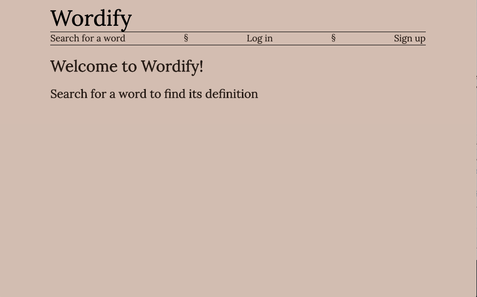
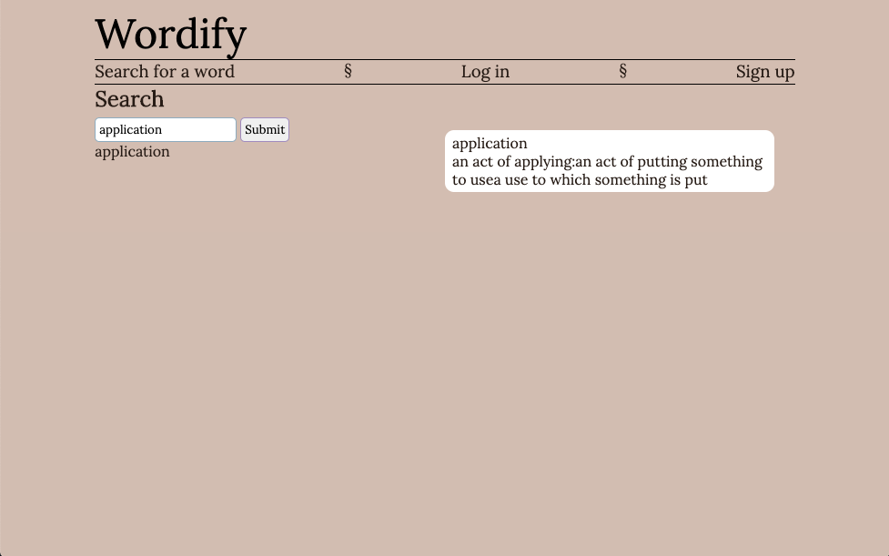

# Wordify

Welcome to Wordify! This app is meant as an aid to all who are reading something dense, and find themselves reaching for a dictionary time and again.

To get started, sign up an account, and navigate to our passage disply feature by clicking on the "Submit a passage" button in the nav bar. When you copy your passage into the document submission form and click submit, the passage text will render below the submission form. When any word from the passage is clicked, its first-listed definition will render on the right side of the page. No need to flip through the pages of your dictionary or tabs of your browser—do it all on a single page through the power of REACT!

Don't want to lose the submitted text? Save it to your documents page, where you can access it for reference at any time. (At this stage in development, you will have to submit the text again in order to read it. Look out for improvements!)

If you find yourself rendering the same word over and again, you might consider adding it to a study list—we have just the feature for you. Navigate to our API page by clicking on "Search" in the nav bar, then enter the word you have in mind. Upon submission, the definition will render, as well as the option to save the submitted word. Saved words will be accessible on your vocabulary list page. There you can also delete them.

## Screenshots

## Technologies Used

The MERN stack:
- Mongoose
- Express
- React
- Node

## Getting Started

[Heroku]
[Trello](https://trello.com/b/Kj8vpi5z/wordify)

## Next Steps

- improve definition render so that sub-definitions are clearly specified
- make "My Documents" a list of titles that click to render a document whose words can be clicked to render definitions as on "Submit a Passage"